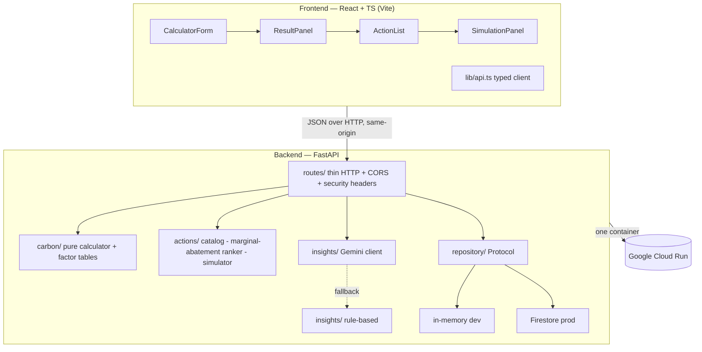

# Architecture

**Design rules.** Dependencies point inward; the domain core is pure and side-effect
free; storage and the LLM are pluggable behind seams (`repository.base.EntryRepository`,
`insights.gemini` → `insights.rules`). This is what keeps the core 100%-testable and
lets the AI path degrade gracefully.
