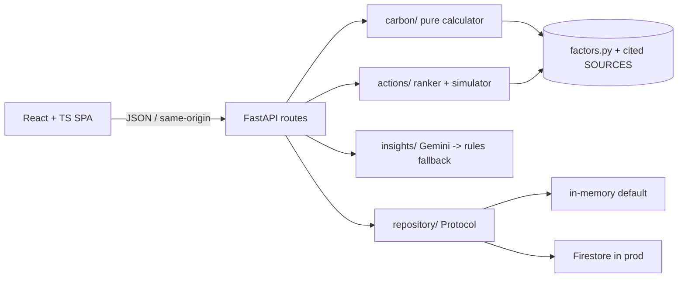

# 🌿 Carbon Counterfactual

> **Virtual PromptWars — Challenge 3.** Helps individuals **understand, track, and
> reduce** their carbon footprint. Not another backward-looking calculator: it lets
> people **simulate the future they'd get from realistic changes**, ranked by impact
> for the effort.

    

**Live demo:** https://carbon-counterfactual-279570839383.asia-south1.run.app

## Why it's different

Every top entry in this challenge is a *form → chart → generic tips* calculator, and
they cluster at the same ceiling score. Carbon Counterfactual changes the product
category: after a lightweight baseline, it ranks reduction actions by a personalised
**marginal-abatement** score (kg CO₂e saved **per unit of effort**, plus ₹ cost), then
lets you **stack actions in a what-if simulator** to see the footprint you'd reach and
whether it hits the Paris-aligned target. Gemini writes the narrative on top of fully
deterministic numbers, with a rule-based fallback so the AI path never hard-fails.

## Architecture at a glance



The domain core (`carbon/`, `actions/`) is pure and deterministic; only `routes/`,
`insights/`, and `repository/` touch the outside world. Full write-up in
[ARCHITECTURE.md](ARCHITECTURE.md).

## How the brief maps to features

| Brief verb | Feature |
| --- | --- |
| Understand | Annual footprint broken down by transport / diet / home / consumption, vs. global, India, and target baselines |
| Track | Append-only snapshot history per anonymous device id |
| Reduce | Actions ranked by impact-for-effort; what-if simulator projects the result |
| Personalized insights | Gemini narrative (rule-based fallback) keyed to the user's own numbers |

## Run it

Backend:
```bash
cd backend
pip install -r requirements-dev.txt
pytest            # 45 tests, 100% coverage, gate >=90%
uvicorn app.main:app --reload
```

Frontend:
```bash
cd frontend
npm ci
npm test          # unit + axe accessibility tests
npm run dev
```

One container (the production pattern): `docker build -t carbon-counterfactual . && docker run -p 8080:8080 carbon-counterfactual`.

## Evidence for the six judging parameters

Each parameter has a dedicated document and a CI gate. Start at **[AI_EVALUATOR_GUIDE.md](AI_EVALUATOR_GUIDE.md)**, which maps every parameter to its proof artifact.

- Code Quality → [CODE_QUALITY.md](CODE_QUALITY.md) · ruff + mypy strict (CI)
- Security → [SECURITY.md](SECURITY.md) · [THREAT_MODEL.md](THREAT_MODEL.md) · headers, validation, pip-audit, firestore.rules
- Efficiency → [PERFORMANCE.md](PERFORMANCE.md)
- Testing → [TESTING.md](TESTING.md) · pytest ≥90% + vitest/axe
- Accessibility → [ACCESSIBILITY.md](ACCESSIBILITY.md) · WCAG 2.1 AA + axe in CI
- Problem Statement Alignment → [PROBLEM_ALIGNMENT.md](PROBLEM_ALIGNMENT.md)
- Architecture overview → [ARCHITECTURE.md](ARCHITECTURE.md)
- Carbon methodology & sources → [CARBON_METHODOLOGY.md](CARBON_METHODOLOGY.md) · Threat model → [THREAT_MODEL.md](THREAT_MODEL.md)
